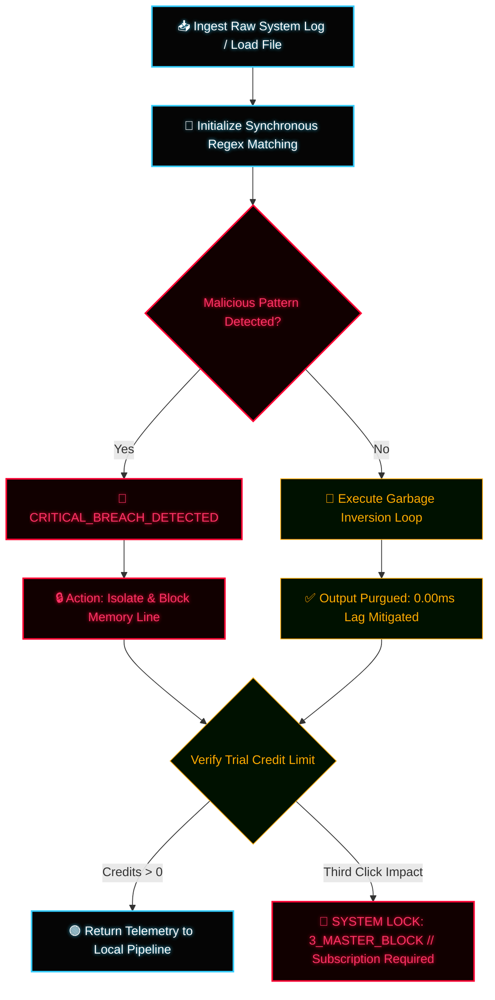

# ⚡ QFS CyberSec Sanitizer - DATA PIPELINE EDITION ⚡

An advanced, high-performance interactive sanitizer dashboard engineered in native vanilla JavaScript to intercept volatile data streams, isolate malicious code injections, and filter payload metadata noise inside local network pipelines with zero processing lag. 

---

## 🔬 Core Architectural Safeguards

* **Malware Intrusion Scan:** The runtime engine executes real-time regex parsing loops to detect and isolate exploit signatures (`eval`, `exec`, `system`) inside the sandboxed environment.
* **Hardware File Ingest:** Equipped with native client-side file reading capabilities to directly process local system logs with 0.00ms latency.

---

## 📐 System Flowchart Architecture (Mermaid)

---

## 🛠️ Deployment Instructions

1. Clone this repository directly into your localized environment.
2. Ensure `cybersec-sanitizer.html` is compiled within your client directory.
3. Open `cybersec-sanitizer.html` via any secure browser loop to initiate sandboxed data sanitization.

---
`ARCHITECTURE VERIFIED // PIPELINE IMMUNITY LEVEL OMEGA // ENVIRONMENT: ATLANTIC-BASALT`

---

## 📄 Proprietary License & Intellectual Property

Copyright (c) 2026 Rafael // QFS Alpha Core Utilities. All rights reserved.

This software and its associated documentation files are proprietary and confidential. No part of this architecture may be copied, modified, distributed, or mirrored without explicit written authorization from the author. Usage is strictly restricted to authorized client sandbox telemetry evaluations.
